# Flutter Android Adaptive Icons Tutorial

## Getting Started
1. Prepare your icons. You need to prepare a background and foreground image.

    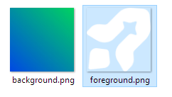

2. Open Android App Icons template on figma or [click here](https://www.figma.com/community/file/1131374111452281708/android-app-icons).

3. Change to **Template** page

    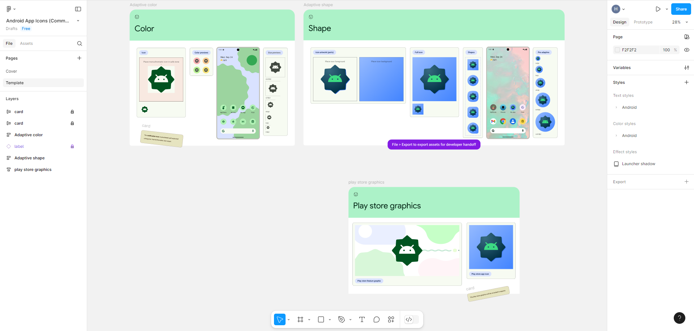

4. Drag you background and foreground image to the canvas.
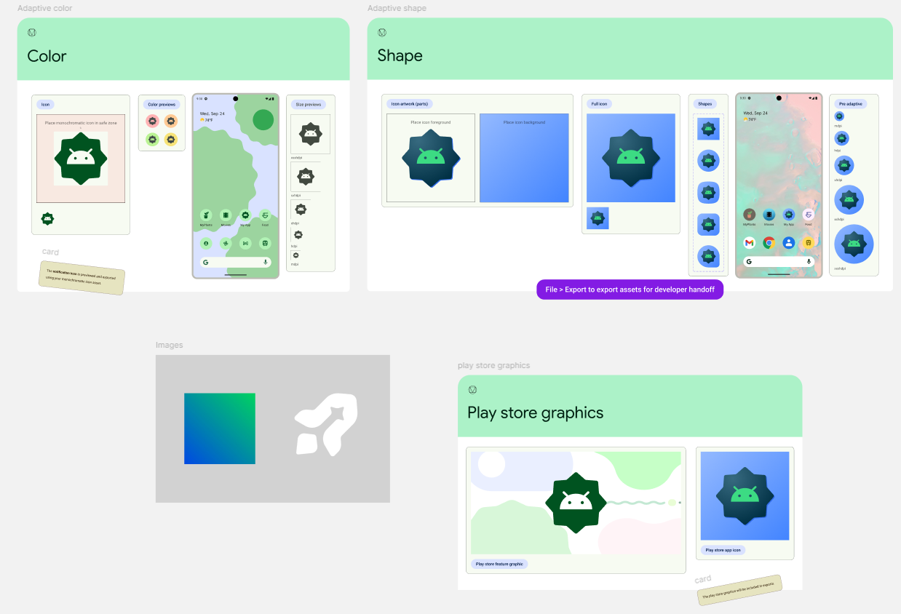

5. Place your image according to the template.
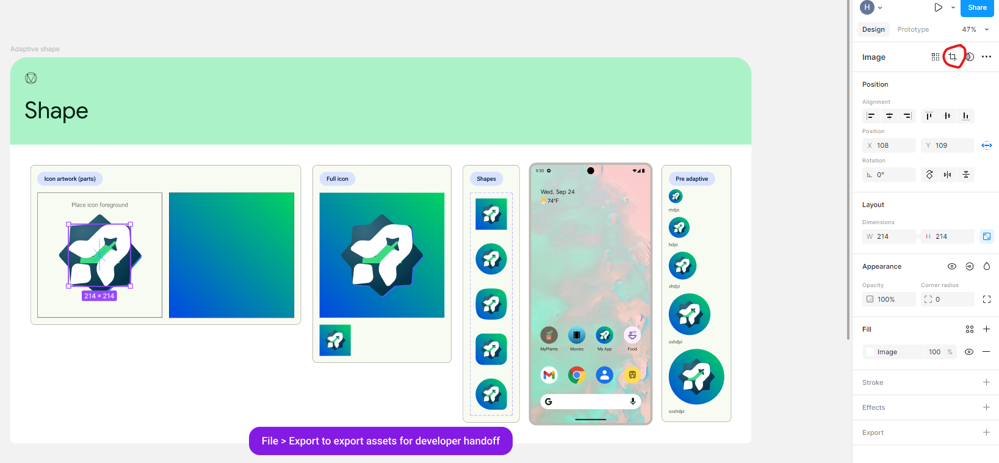

    then click **Align vertical centers** in the alignment section circled in red to make the foreground image center.

6. Remove the template foreground image.

    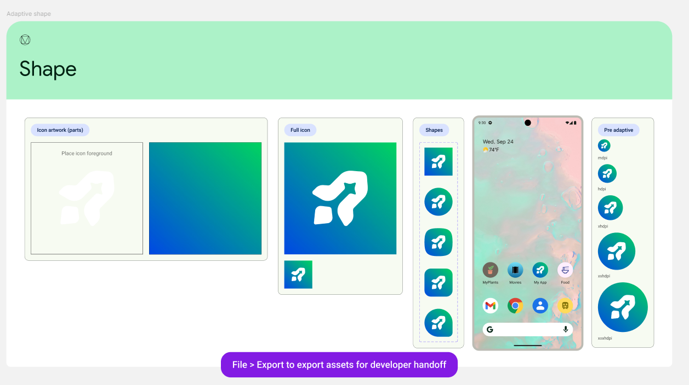

7. Export the icons by pressing "**ctrl + shift + e**" on windows or "**command + shift + e**" on mac.

8. Extract the zip and copy all the mipmap files to **android/app/src/main/res** folder.

    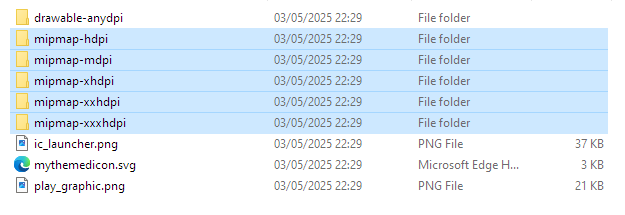
    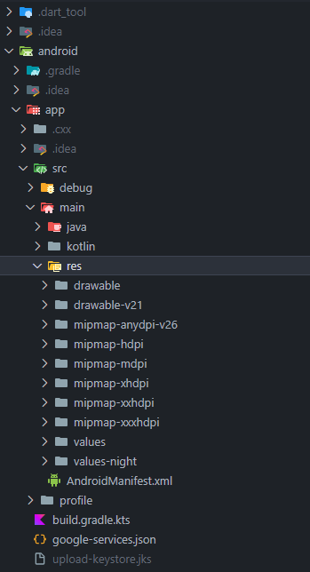

9. then we need to convert these svg's generated by figma in **drawable-anydpi** folder to vector asset with **Android Studio**
    
    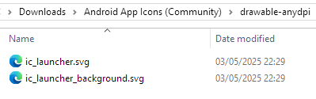

10. Open **Android Studio** and open an android project, then click **Resource manager** menu on the sidebar.

    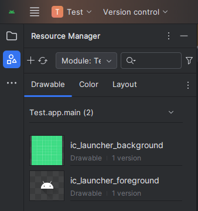

11. Click add button and choose **Vector Asset**.

    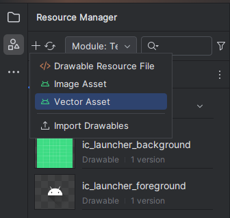

12. Choose the files from the **drawable-anydpi** folder, click next and finish.

    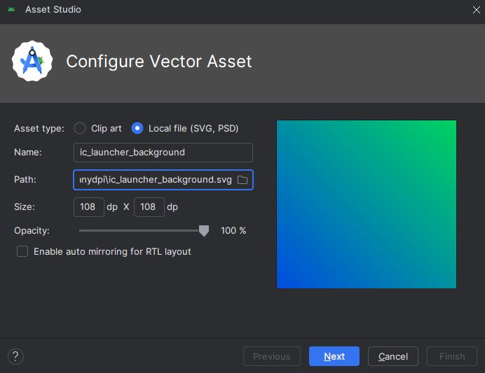

    if you encountered this issue below, click [here](#fix-image-convertion-issue) to fix the issue.

    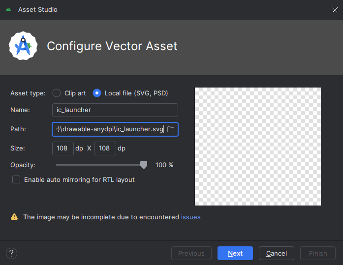
    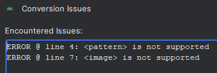

13. Now we have converted it to **Vector Asset**
    
    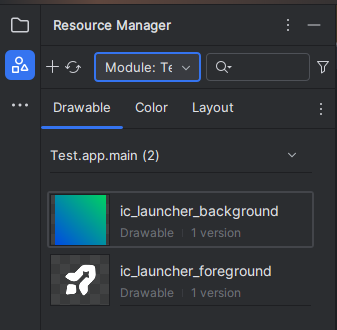

14. Copy the XML to **android/app/src/main/res/drawable** folder.

    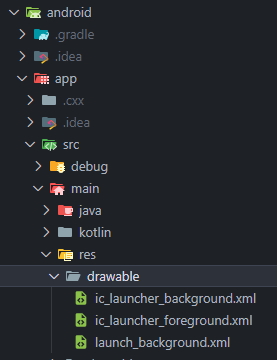

15. Create a file **ic_launcher.xml** in **android/app/src/main/res/mipmap-anydpi-v26** folder and copy this code:
    ```xml
    <?xml version="1.0" encoding="utf-8"?>
    <adaptive-icon xmlns:android="http://schemas.android.com/apk/res/android">
        <background android:drawable="@drawable/ic_launcher_background" />
        <foreground>
            <inset
                android:drawable="@drawable/ic_launcher_foreground"
                android:inset="16%" />
        </foreground>
        <monochrome>
            <inset
                android:drawable="@drawable/ic_launcher_foreground"
                android:inset="16%" />
        </monochrome>
    </adaptive-icon>
    ```

16. Run your flutter app.

## Fix Image Convertion Issue
If you encountered issue like this:
    
    


You can follow this steps:
1. Open figma and drag your png image that has issue.

    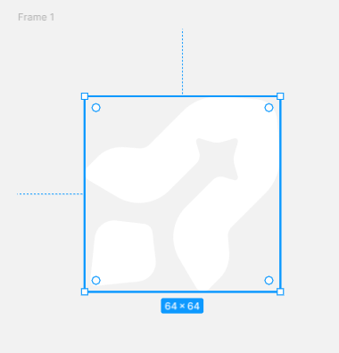

2. Select image and click **actions**, then search **Vectorize Bitmap** plugin.

    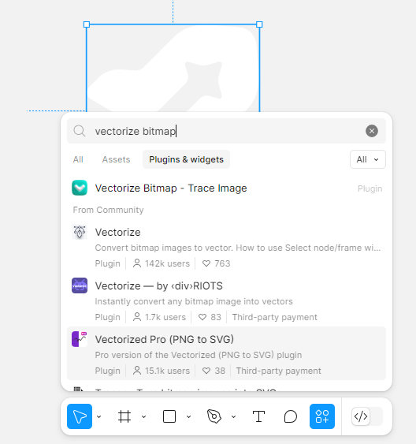

3. The **Vectorize Bitmap** window will be show, then click **ok**.

    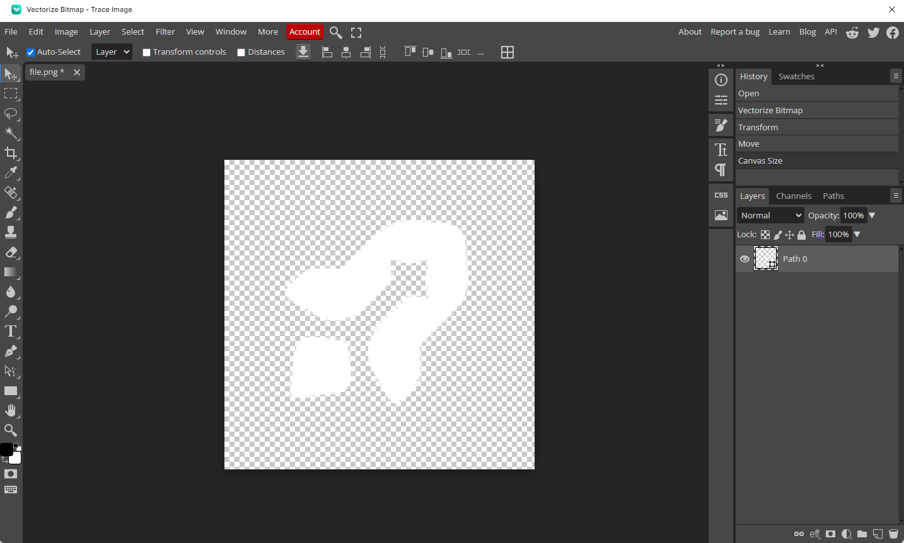

    Then you change the Canvas Size to 108x108 and the Image Size to 64x64 and save it by press **ctrl + s**.

    And we got the vector image.

    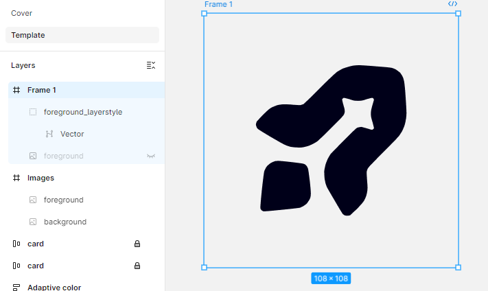

4. Export the frame into svg.

5. Now you can convert it into **Vector Asset**.